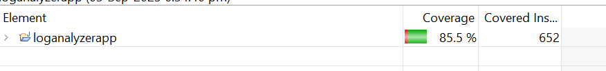

# Loganalyzerapp Overview
- It reads given log file and filter records by log type and top value.

## Technology Stack
- Spring Boot 2.7.10
- Java 11
- Maven
- Junit 

##Code Coverage

## Achieved functionalities

1. One endpoint to read log file by given log type and top value, validate inputs.

## Application running instructions
- Step1 : mvn clean install (In cgiassignment directory)
- Step2 : mvn spring-boot:run(In cgiassignment/loganalyzerapp)

## Swagger Documentation
- [Loganalyzer Application Swagger Doc](http://localhost:8005/swagger-ui.html)

## URL
- Note: Start application in port 8005
- [Get Log details](http://localhost:8005/logging?logType=ERROR&top=3)
