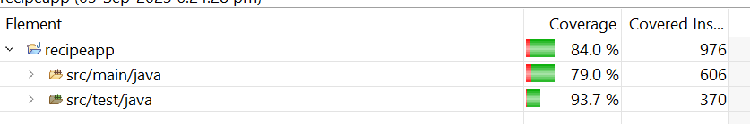

# Recipeapp Overview
- It reads recipe from json files and return response.
- Filter recipe by inputs ingredients.

## Technology Stack
- Spring Boot 2.7.10
- Java 11
- Maven
- Junit 

##Code Coverage

## Achieved functionalities

1. One endpoint to display all recipes
2. Add another endpoint which takes array of ingredients as input. The output should give list of recipes which consists of all the given input ingredients and validate given inputs.

## Application running instructions
- Step1 : mvn clean install (In cgiassignment directory)
- Step2 : mvn spring-boot:run(In cgiassignment/recipeapp)

## Swagger Documentation
- [Recipe Application Swagger Doc](http://localhost:8004/swagger-ui.html)

## URL
- Note: Start application in port 8004
- [Get All Recipes](http://localhost:8004/recipe)
- [Get Recipe By Ingredients](http://localhost:8004/recipe/getByIngredients?ingredients=onions,mushrooms)